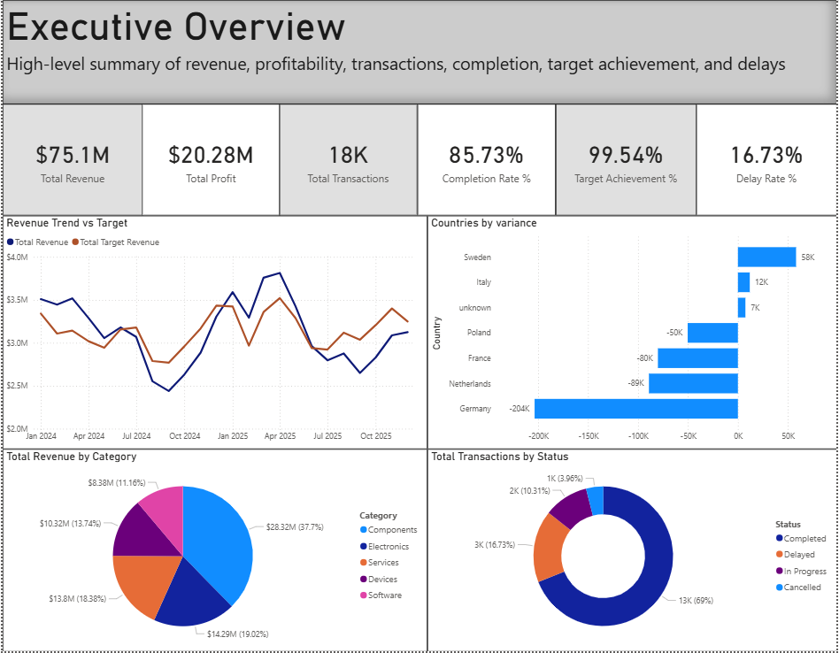
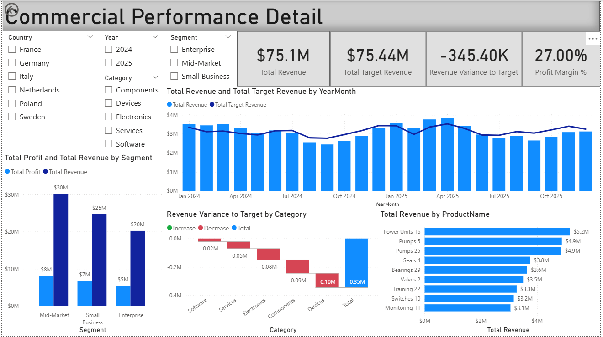
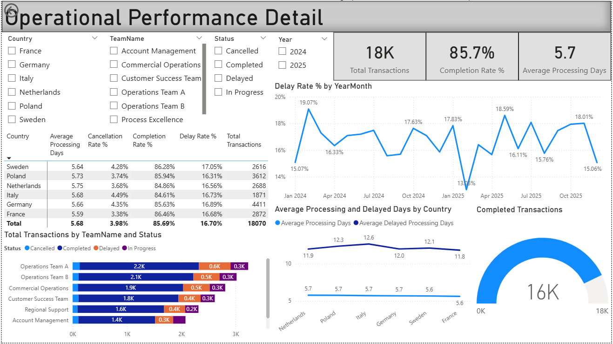
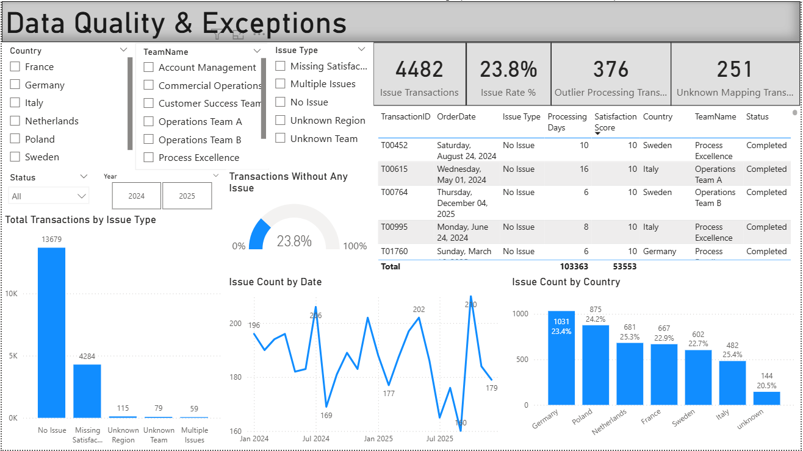

# Operations KPI & Performance Dashboard

A multi-page **Power BI dashboard project** built to analyze commercial performance, operational efficiency, and data quality through a structured reporting experience with executive summary, detailed analysis pages, and regional drill-through views.

## Overview

This project was created as a **Power BI portfolio dashboard** to demonstrate practical BI skills across the full reporting workflow:

- synthetic dataset design in **Python**
- data preparation in **Power Query**
- **star schema** data modeling
- **DAX** KPI and analytical measure creation
- multi-page dashboard design
- slicers and interactivity
- drill-through navigation
- business-oriented storytelling
- data quality and exception monitoring

A key part of this project was building the dataset itself in Python rather than relying on a downloaded sample file. The data was generated to simulate a more realistic business environment, including uneven regional volumes, country-level variation, product mix differences, seasonality, target-vs-actual gaps, missing values, unknown mappings, outliers, and duplicate records. This made the reporting, cleaning, and KPI design much more meaningful.

---

## Report Structure

### Main pages
1. **Executive Overview**  
   High-level summary of revenue, profitability, transactions, completion, target achievement, and delays.

2. **Commercial Performance Detail**  
   Deeper analysis of revenue, target performance, product contribution, and commercial segmentation.

3. **Operational Performance Detail**  
   Focused view of transactions, completion, delays, processing efficiency, and team-level operational performance.

4. **Data Quality & Exceptions**  
   Monitoring page for issue rates, exception trends, unknown mappings, outliers, and record-level investigation.

### Regional drill-through pages
5. **Regional Commercial Performance Detail**  
6. **Regional Operational Performance Detail**  
7. **Regional Data Quality & Exceptions**

The regional pages are designed as **drill-through views** to support deeper investigation without overloading the main navigation experience.

---

## Key Features

- executive KPI summary page
- detailed commercial, operational, and data quality analysis
- country-level and regional-level reporting views
- drill-through navigation with focused regional pages
- issue monitoring and exception analysis
- record-level detail tables for investigation
- clean separation between summary reporting and detailed analysis

---

## Data Model

The report uses a **star schema** centered around:

### Fact table
- `Fact_Operations`

### Dimension tables
- `Dim_Date`
- `Dim_Customers`
- `Dim_Products`
- `Dim_Region`
- `Dim_Team`

Modeling decisions:
- many-to-one relationships
- single-direction filtering
- active relationships
- dedicated measures table
- date table configuration
- hidden technical keys for cleaner report development

---

## Dataset & Data Preparation

The dataset was **generated in Python** and then prepared in **Power Query** for reporting.

The Python-generated data includes:
- a transaction-level fact table
- supporting dimension tables
- realistic country/region structure
- uneven regional distribution
- product/category skew
- seasonal revenue behavior
- target revenue variation
- operational statuses and processing times
- controlled data quality issues such as missing values, unknown mappings, outliers, and duplicates.

Power Query preparation then included:
- duplicate removal
- handling missing values
- replacing blank region/team mappings with `"unknown"`
- preserving original numeric fields while creating cleaned reporting fields
- creating helper columns for reporting and issue detection

Examples of reporting/helper fields:
- `CostClean`
- `ProfitClean`
- `TargetRevenueClean`
- `DelayFlag`
- `ProcessingDaysFlag`
- `DataQualityIssueFlag`
- `Issue Type`

---

## DAX & KPI Development

The report includes around **45 DAX measures**, covering:

- revenue and profit KPIs
- target tracking
- completion and delay metrics
- processing efficiency measures
- variance calculations
- trend analysis
- data quality and exception metrics

Examples:
- Total Revenue
- Total Profit
- Total Transactions
- Total Target Revenue
- Completion Rate %
- Delay Rate %
- Profit Margin %
- Target Achievement %
- Average Processing Days
- Revenue Variance to Target
- Issue Count
- Unknown Mapping Count
- Issue Rate %

---

## Tools Used

- **Power BI**
- **Power Query**
- **DAX**
- **Python** for synthetic data generation

---

## Why this project is relevant

This project demonstrates the ability to build a dashboard beyond simple chart creation by combining:

- structured data modeling
- metric design
- multi-page report architecture
- interactive analysis
- drill-through navigation
- exception-aware reporting
- business-focused dashboard storytelling

---

## Repository Contents

```bash
Operations-KPI-Dashboard/
│
├── README.md
├── Operations KPI Dashboard.pbix
├── screenshots/
│   ├── executive_overview.png
│   ├── com_perf.png (commercial-performance-detail)
│   ├── regional-commercial-performance-detail.png
│   ├── op_perf.png (operational-performance-detail)
│   ├── regional-operational-performance-detail.png
│   ├── data_quality.png (data-quality-exceptions)
│   └── regional-data-quality-exceptions.png
└── data/
````

---

## Screenshots

### Executive Overview



### Commercial Performance Detail



### Operational Performance Detail



### Data Quality & Exceptions



---

## Notes

* This is a **personal project** built for demonstration and learning purposes.
* The dataset is **synthetic/generated** to simulate a realistic operations reporting scenario.
* The report was designed to balance executive summary reporting with deeper analytical exploration.

---

## Author

**Abdul Wahab Madni**
